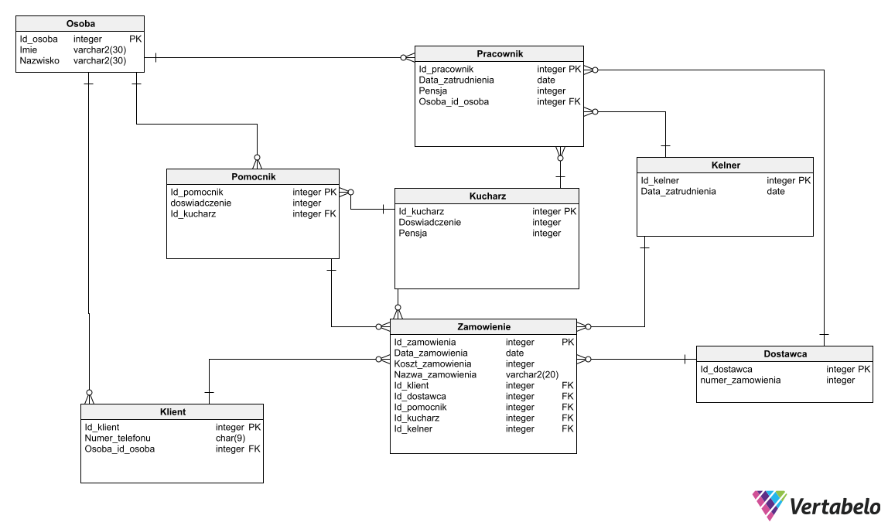

<h1>Database Project</h1>

This repository contains source of my database collage project. First part inside `sql` folder is made purely in sql on oracle database. Second project is made in tsql in MS SQL Server and pl/sql in Oracle server. This project was made in two semesters on two subject related to relation database.

## Semester project for sql / PART 1

Część SQL projektu składa się z dwóch części i ma następujące wymagania:

* Założenie tabel oraz wpisanie do nich przykładowych danych – 5 punkty
* Dwanaście zapytań SQL (12 punktów, 1 punkt przyznawany jest za każde poprawnie zrealizowane zapytanie): 
    * 3 zapytania podstawowe, 
    * 3 zapytania zawierające złączenia,
    * 3 zapytania zawierające grupowanie, 
    * 3 zapytania zawierające podzapytania) 
    
Zapytania muszą mieć sens i stanowić odpowiedź na jasno sprecyzowane pytanie.

## Semester project tsql & pl/sql / PART 2:

Projekt semestralny musi zawierać:
* opis zagadnienia (z zeszłego semestru)
* diagram związków encji (z zeszłego semestru)
* skrypty DDL dla MS SQL Server i ORACLE z diagramu własnego projektu
* skrypty DML wypełniające tabele przykładowymi danymi (po kilka rekordów na tabelę)
*minimum dwie procedury w każdym ze środowisk (ORACLE i MS SQL Server)
* minimum dwa wyzwalacze  w każdym ze środowisk (ORACLE i MS SQL Server)

W jednym z tych obiektów należy użyć kursora - w T-SQL może to być w wyzwalaczu lub procedurze, w PL/SQL w procedurze. 

W PL/SQL jeden z wyzwalaczy ma być FOR EACH ROW.

Procedury i wyzwalacze muszą się uruchamiać!

Skrypty procedur i wyzwalaczy należy zapisać w plikach .sql

## Entity diagram

Here is entity relationship diagram for oracle server, but mssql is mostly the same, only diffrence is that it has diffrent data types

